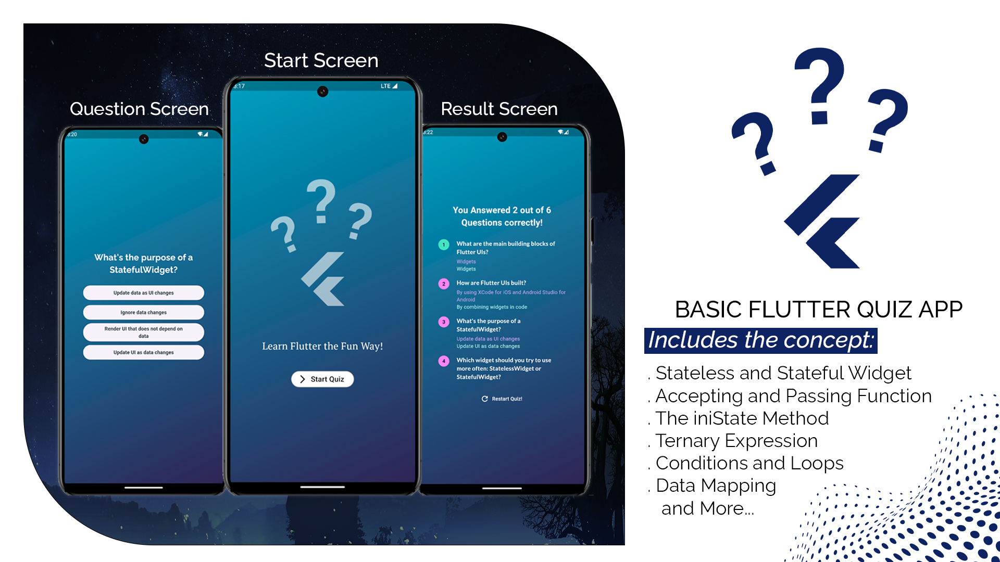

```markdown
# Basic Quiz App

This is a basic quiz app built using Flutter and Dart. It consists of three main screens:

- **Start Screen:** Initiates the quiz.
- **Question Screen:** Presents questions with multiple-choice options.
- **Result Screen:** Displays the final score.

## Technologies Used

- Flutter
- Dart




## Getting Started

To get a local copy up and running follow these simple steps.

### Prerequisites

- Flutter SDK installed
- Emulator or physical device for testing

### Installation

1. Clone the repo
   ```sh
   git clone https://github.com/your_username_/Project-Name.git
   ```
2. Install dependencies
   ```sh
   flutter pub get
   ```
3. Run the app
   ```sh
   flutter run
   ```

## Contributing

Contributions are what make the open-source community such an amazing place to learn, inspire, and create. Any contributions you make are **greatly appreciated**.

1. Fork the Project
2. Create your Feature Branch (`git checkout -b feature/AmazingFeature`)
3. Commit your Changes (`git commit -m 'Add some AmazingFeature'`)
4. Push to the Branch (`git push origin feature/AmazingFeature`)
5. Open a Pull Request

